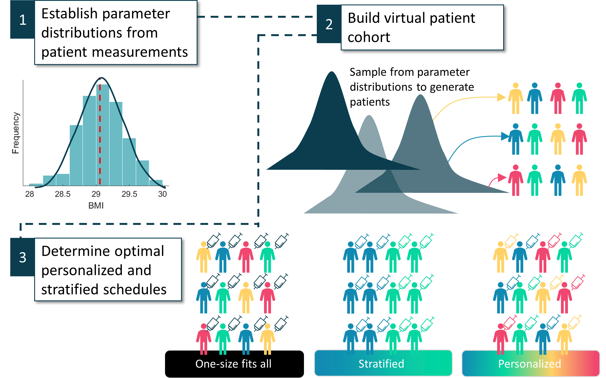

Code in this repositiory was used to produce the results in the paper: 

"Establishing combination PAC-1 and TRAIL regimens for treating ovarian cancer based on patient-specific pharmacokinetic profiles using in silico clinical trials"
Olivia Cardinal, Chloé Burlot, Yangxin Fu, Powel Crosley, Mary Hitt, and Morgan Craig, Adrianne L. Jenner (submitted 2022)

Below are details of how to reproduce the results in the manuscript. For more information contact adrianne.jenner@qut.edu.au or morgan.craig@umontreal.ca

Figure 2:
To generate a distribution of virtual patients set a total number of virtual patients num_patients and run the function VP=GeneratingPatients(num_patients). 
This will given a matrix num_patients x 5 matrix VP where each row is an individual virtual patients 5 parameters: Vd_PAC1, CL_PAC1, Vd_TRAIL, CL_TRAIL, BW. 

Figure 3: 
To generate an initial simulation of the model for the virtual patients under a single injection of PAC-1 and TRAIL run commands_initialpatientmodelbehaviour.m

Figure 4:
To determine each individual virtual patient's optimal treatment of PAC-1 and TRAIL run commands_optimizer.m

Figure 5: 
To investigate the characteristics of the new sub cohorts run the code commands_cohort1vscohort2.m

Figure 6: 
To create a population of new virtual cohorts based on the sub cohorts identified in Figure 5, used commands_creatingnewcohorts.m. To then determine protocols that are optimal for all individuals in the sub cohorts run commands_subcohortoptimal.m
